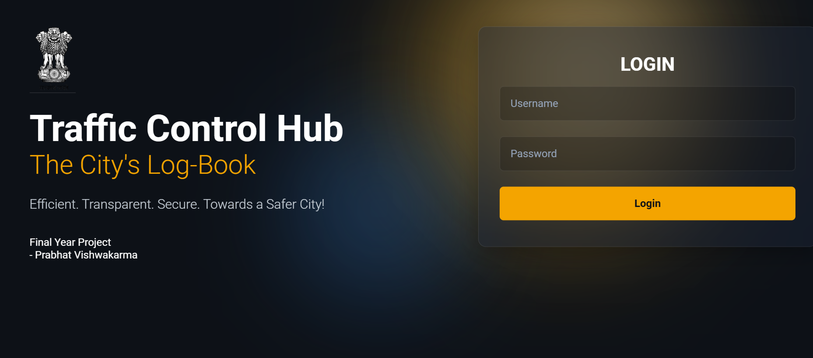
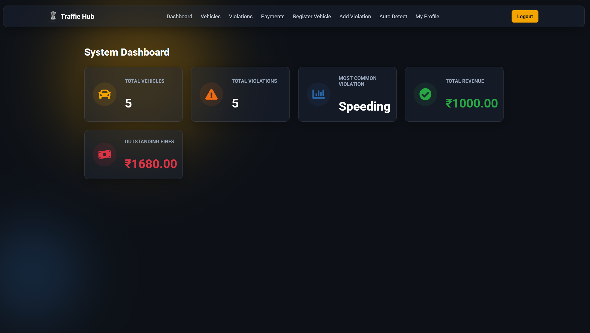
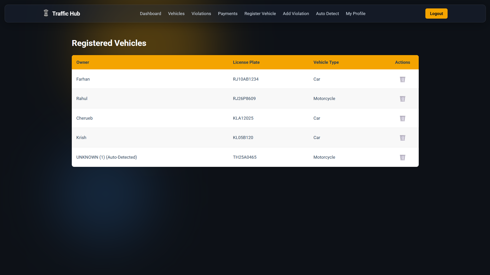
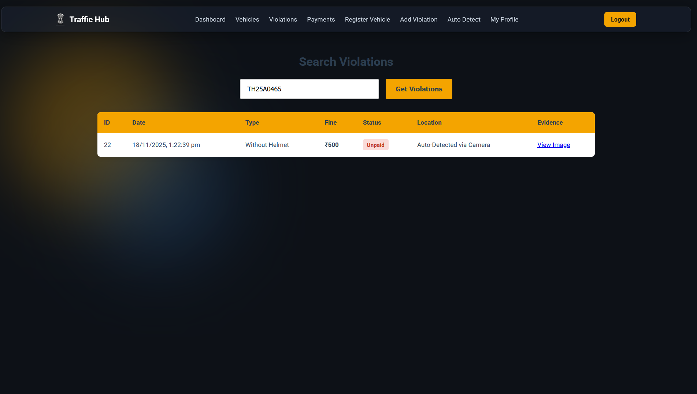
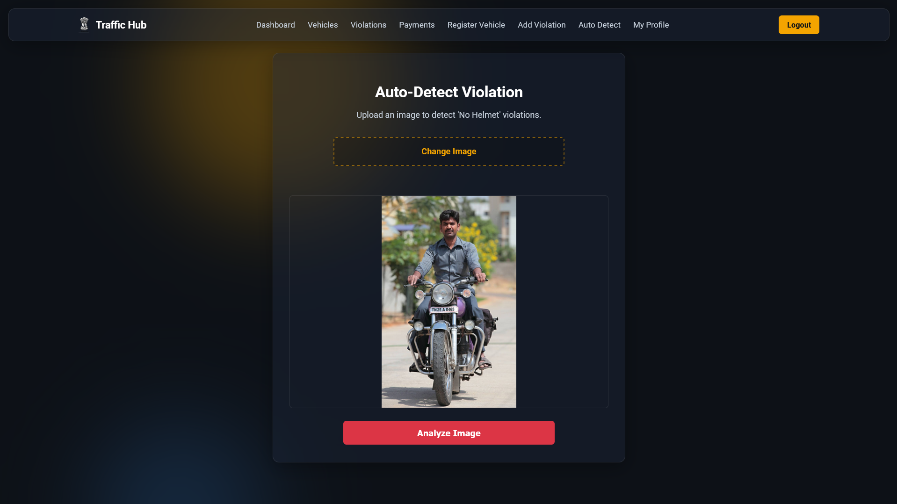
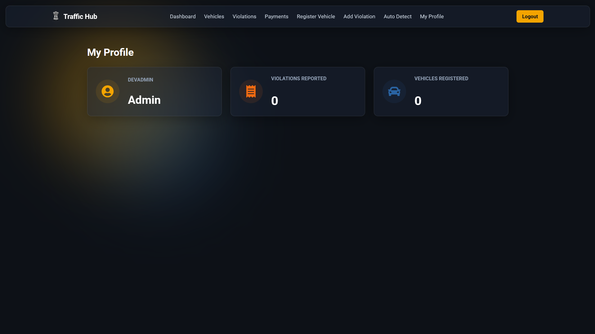

# 🚦 Traffic Management System with AI Violation Detection

A full-stack **Traffic Management System** built with **Flask, React, MySQL, and AI**. The system manages vehicles, violations, payments, and includes an **AI-powered helmet violation detector with automatic license plate recognition**.

## ⭐ Key Features

### 🔐 Authentication

* Login & registration
* Password hashing (bcrypt)
* JWT-based authorization
* Admin/user role support

### 🚗 Vehicle Management

* Add, view, search, and delete vehicles
* Auto-registration of unknown vehicles detected through AI or IoT
* Admin-only delete access

### ⚠️ Violation Management

* Add violations manually
* View violations per vehicle
* Check violation details
* Update fine status after payment

### 🤖 AI Violation Detection

Uses **YOLOv8** + **EasyOCR** to automatically detect:

#### ✔ Helmet Status

* Detects With Helmet / Without Helmet
* Creates bounding boxes + labels on the image

#### ✔ License Plate OCR

* Detects license plate
* Extracts plate number using OCR
* Auto-registers vehicle if not found
* Auto-inserts violation into MySQL
* Saves annotated evidence image

**API:** `POST /autodetect`

### 📡 IoT Radar Gun Simulation

Simulates an IoT device reporting speeding violations:

* Validates API key
* Auto-registers unknown vehicles
* Calculates fine based on speed
* Logs "Speeding" violation

**API:** `POST /iot/report-speeding`

### 📊 Dashboard Stats

Provides summary stats:

* Total vehicles
* Total violations
* Total fines paid/unpaid
* Most common violation

### 👤 User Profile Stats

* Username
* Role
* Violations reported
* Vehicles registered

## 🧠 Machine Learning Models

* YOLOv8 helmet detection → `Weights/best.pt`
* YOLO license plate detection → `license_plate_detector.pt`
* OCR → EasyOCR
* OpenCV for image processing

## 🗄 Database Structure

MySQL tables:

```
loginuser
Vehicle
Violations
Fines
```

## 📸 Screenshots

### 🔐 Login Page



### 📊 Dashboard



### 🚗 Vehicles Page



### ⚠️ Violations Page



### 🤖 Auto-Detection



### 👤 My Profile



## 🛠️ Tech Stack

**Backend:** Flask, OpenCV, YOLOv8, EasyOCR, MySQL, JWT, bcrypt

**Frontend:** React.js, Axios, React Router

## ▶️ How to Run the Project

1. Install Python dependencies:

```
pip install -r requirements.txt
```

2. Create MySQL database `TrafficDB` and import `TrafficDB.sql`.
3. Run backend:

```
python app.py
```

4. Run frontend:

```
cd traffic-violation-frontend
npm install
npm start
```

## 📦 Folder Structure

```
Traffic-Management-System-With-Ai/
├── app.py
├── iot_radar_gun.py
├── TrafficDB.sql
├── Weights/
├── evidence_uploads/
├── traffic-violation-frontend/
└── screenshots/
```

## 📄 License

Academic & educational use.

## 🙌 Acknowledgments

YOLOv8, EasyOCR, OpenCV, Flask, React communities.
